# Enterprise Network Lab (Cisco Packet Tracer)

## Overview

Designed and implemented a segmented enterprise LAN using VLANs, inter-VLAN routing, DHCP, and DNS.

The network separates IT, HR, and Guest traffic while allowing controlled communication between VLANs.

---

## Technologies

* Cisco Packet Tracer
* VLANs (802.1Q)
* Inter-VLAN Routing (Router-on-a-Stick)
* DHCP (multi-scope + relay)
* DNS

---

## 1. Network Topology

This diagram shows the overall network design, including router, switches, server, and end devices.

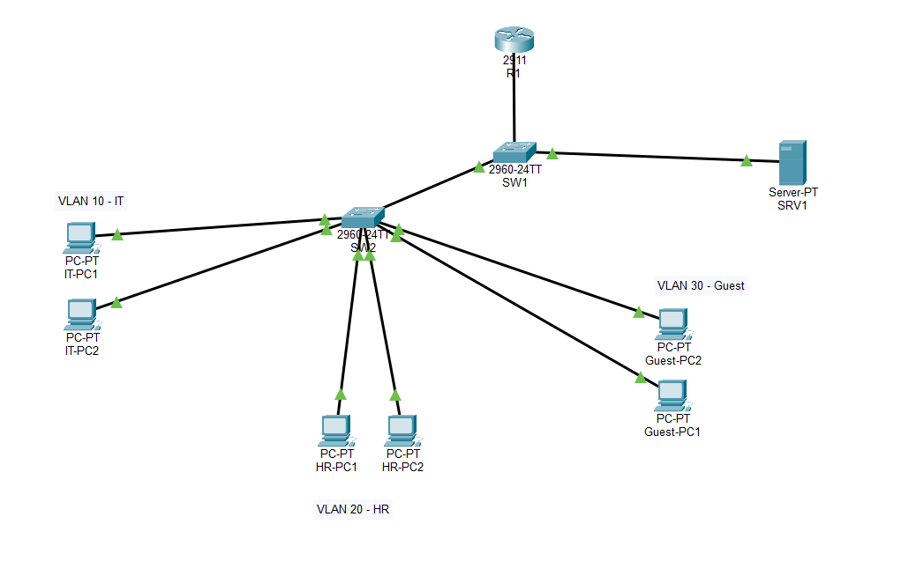

---

## 2. Subnetting Plan

Defined subnet ranges for each VLAN based on department size.

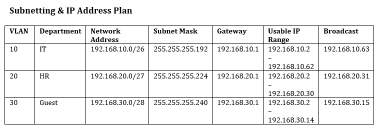

---

## 3. VLAN Configuration

Created VLANs for each department:

* VLAN 10 – IT
* VLAN 20 – HR
* VLAN 30 – Guest

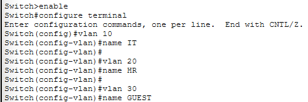
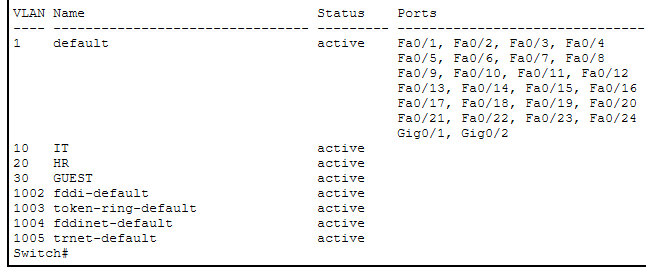

---

## 4. Trunk Configuration

Configured trunk links between switches to allow VLAN traffic across the network.

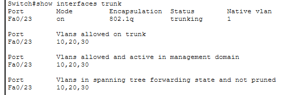

---

## 5. Inter-VLAN Routing

Implemented router-on-a-stick using subinterfaces to enable communication between VLANs.

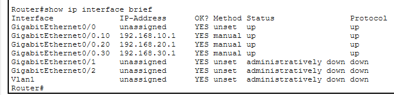

---

## 6. Connectivity Test

Verified communication between devices in different VLANs.

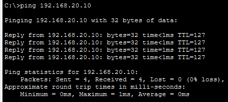

---

## 7. DNS Configuration

Configured a DNS server to resolve hostnames to IP addresses.

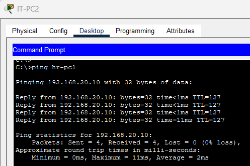

---

## 8. DHCP Configuration

Configured DHCP server with multiple scopes for each VLAN and implemented DHCP relay on the router.

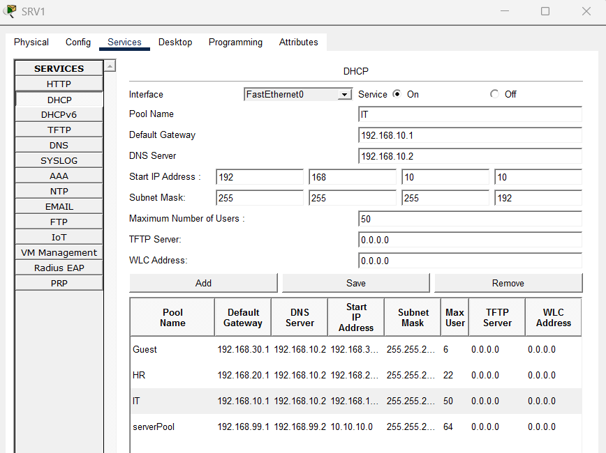
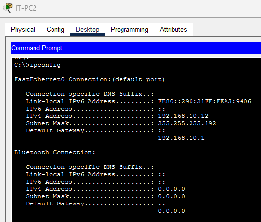
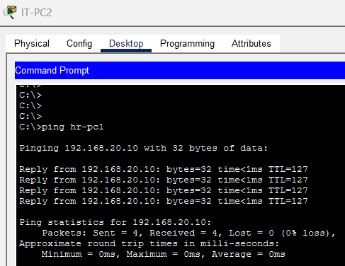

---

## 9. Troubleshooting

* Resolved DHCP issue caused by conflicting default server pool
* Configured `ip helper-address` for DHCP relay
* Verified VLAN trunking and correct port assignments
* Ensured DNS resolution across VLANs

---

## Conclusion

This project demonstrates the design, implementation, and troubleshooting of a small enterprise network using VLAN segmentation, routing, and network services.

---

